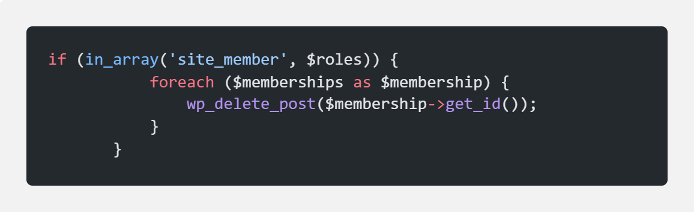

## Description

# Plugin that will allow you to manage several WooCommerce Memberships plan on wordpress sites.

# Plugin qui vous permettra de gérer plusieurs abonnements WooCommerce sur différents sites wordpress.

## Installation

> Install "wp-remote-users-sync /" is configured on your different sites
> The plugin is located at this address:
> https://wordpress.org/plugins/wp-remote-users-sync/
> Install on the second site: Remote-woocommerce-memberships-sync
> Create a role associated with memeberships on your master site.
> You can add the role created by you in the condition for creating the memberships plan on the child site
> 

## Usage

## Configuration
